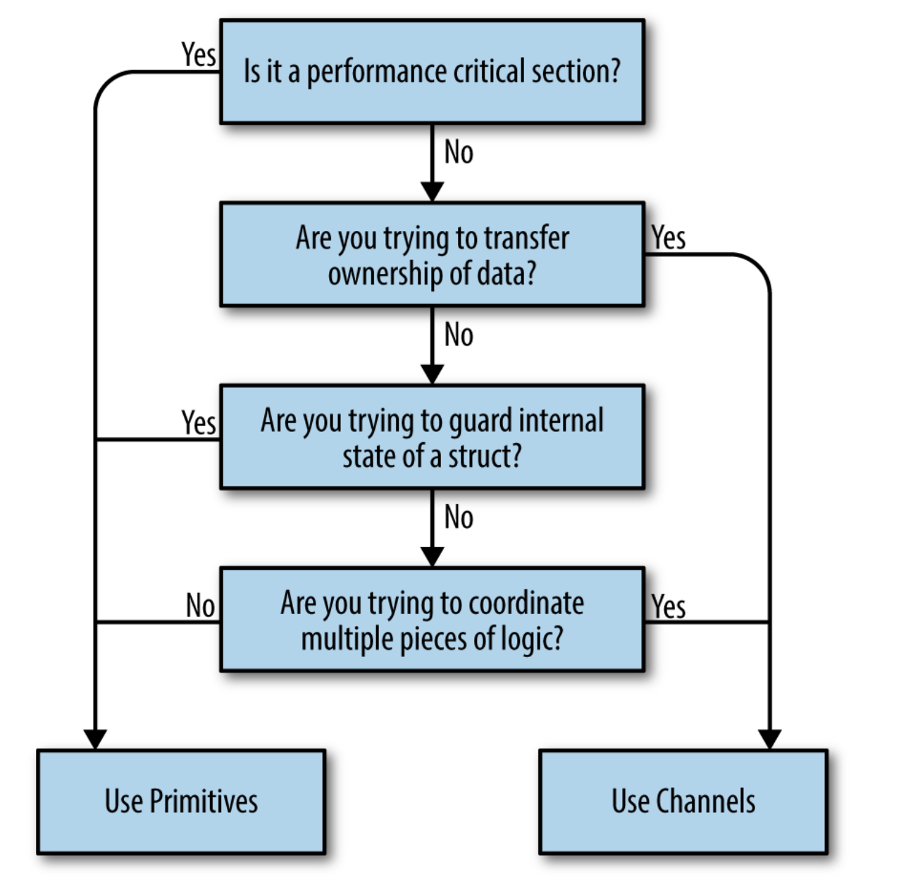

# Hello to Concurrency in GO!

* Concurrency is a property of Code while Parellelism is a property of running program ! => Meaning we wrtie concurrent code and hope that it will run in parellel.

* Goroutines are absctraction over os treads managed by the go runtime.
* Goroutines Follow a "Fork+JOin" model. go initiales fork and join is branching back.

* Atomic Operaitons are “indivisible” and “uninterruptible.”
* Context is super important as a process might be Atomic in context of a group of process and not others
* An operation i++. fetch update store can be atomic in it's own context but all 3 as a whole in os's context it cannot be as preemption can happen

* A Deadlocked program is one in which all concurrent processes are waiting on one
another. In this state, the program will never recover without outside intervention. 

## Coffman's Conditions for Deadlocks

* Mutual Exclusion
* Wait for Condition
* No Preemption
* Circular Wait

* Livelocks are programs that are actively performing concurrent operations, but these
operations do nothing to move the state of the program forward.

* Starvation is any situation where a concurrent process cannot get all the resources it
needs to perform work.

## Communitcating Synchronous Processes

* The CSP is a style as well as a paper from which the modern golang concurrency is inspired

## Diagram on choosing legacy based concurrnecy or modern channel based concurrnecy

